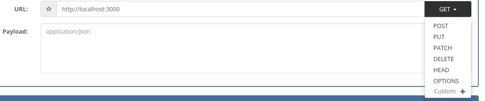

## Brief

### Preparation

Instructors to walk through with the students to do `npm init` in the src folder to create a package.json.

After the setup, create the `index.js` file and install express via the command `npm install express`.

Add a start script in package.json:

```json
"scripts": {
    "test": "echo \"Error: no test specified\" && exit 1",
    "start": "node index.js" //add this line
  },
```

Add a gitignore file for the node_modules.

### Lesson Overview

This lesson will be focusing on learning ExpressJS, a JS framework that can be used to streamline the creation of backend servers. The first half will focus on the setup of express and basic routing and the second part will focus on learning about REST and creating REST endpoints.

---

## Part 1 - ExpressJS and Routing

Express is a minimal and flexible Node.js web application framework that provides a robust set of features and with a myriad of HTTP utility methods and middleware for web and mobile API creation.

### Getting started

```js
//index.js
const express = require("express"); //uses the express package

const app = express(); //Creates an express application
const port = 3000; //Port

//Route for GET "/"
app.get("/", (req, res) => {
    res.send("Hello World!");
});
  
app.listen(port, () => {  //Listen to port
    console.log(`App listening on port ${port}`);
});
```

To test the application, run `npm start` or `npm run start`, and access `http://localhost:3000` via YARC or Postman.

With this, the phrase `Hello World!` is sent to the client as a response.

### Routing

Routing determines how an application responds to a client request to a particular endpoint, which is a URI (or path) and a specific HTTP request method (GET, POST, and so on).

Example: GET "/fruits", POST "/login", etc.

The following are the commonly used HTTP request methods / verbs

| Verb | Function |
|----|---------|
| GET | Retrieves information |
| POST | Sending information or creation of new entries |
| PUT / PATCH | Updates information |
| DELETE | Deletes information |

Each route has a handler function, which is executed when the route is matched.

A route in express follows the syntax:

```
app.method(path, handler)
```

Where:

- app is an instance of express.
- method is an HTTP request method, in lowercase.
- path is a path on the server.
- handler is the function executed when the route is matched.

Example:
```js
app.get("/", (req, res) => {
    res.send("Hello World!");
});
```

In this route, the method is GET, the path is "/" or the application's root / homepage. And the handler functions returns an response with the string "Hello World".

POST route:
```js
app.post("/login", (req, res) => {
    res.send("POST request at /login");
});
```

PUT route:
```js
app.put("/cart", (req, res) => {
    res.send("PUT request at /cart");
});
```

DELETE route:
```js
app.delete("/cart", (req, res) => {
    res.send("DELETE request at /cart");
});
```

Test out the newly created routes via YARC or Postman. The http method can be changed in the dropdown menu.



### Requests

Requests are composed of URIs and HTTP methods. In order to add dynamic information to the routes, route parameters can be used.

Route parameters are named URL segments that are used to capture the values specified at their position in the URL. The captured values are populated in the req.params object, with the name of the route parameter specified in the path as their respective keys.

```js
app.get("/items/:id", (req, res) => {
    res.json(req.params);
});
```

Test out the route by providing a value for the id as part of the URI. Ex. "http://localhost:3000/items/189";


The parameters object is sent as a JSON back to the client.

Another part of the request is the body or payload. This contains the information to be sent to the server for processing. The req.body object contains the information received and the keys correspond to the keys in the body.

```js
...
const port = 3000;
app.use(express.json()); //allows express to read json from the request body.
...
app.post("/register", (req, res)=>{
    res.json(req.body);
});
...
```

To test out the body, provide the data as seen below:


*Note: In Postman, select "Body" then in the dropdown, select "JSON"*

---

## Part 2 - REST endpoints

REST, or REpresentational State Transfer, is an architectural style for providing standards between computer systems on the web.

It make communication between systems easier for systems by how they are stateless and separates the concerns of client and server. 

REST endpoints follow the convention in such a way that the client only needs to define a specific path and would have different responses based on the different methods.

Example:
| Route | Function |
|----|---------|
| GET "/fruits" | Retrieves all fruits |
| GET "/fruits/:id" | Retrieves a fruit with matching id |
| POST "/fruits | Adds a new fruit |
| PUT "/fruits/:id" | Updates a fruit with matching id |
| DELETE "/fruits/:id" | Deletes a fruit with matching id |

```js
...
const fruits = [
    {
        id : 1,
        name : "banana"
    },
    {
        id : 2,
        name : "mango"
    }
]
...

//GET /fruits
app.get("/fruits", (req, res) => {
    res.json(fruits);
});

//GET /fruits/:id
app.get("/fruits/:id", (req, res) => {
    for (let fruit of fruits) {
        console.log(req.params.id);
        if (fruit.id == req.params.id) {
          res.status(200);
          return res.send(fruit);
        }
    }
    res.status(404);
    res.send("Fruit not found");
})

//POST /fruits
app.post("/fruits", function (req, res) {
    if (fruits.length > 0 && fruits.some((f) => f.name === req.body.name)) {
        res.status(409);
        return res.send("Fruit already exists");
    }
    let index = fruits[fruits.length - 1].id + 1;
    const newFruit = {
        id : index,
        name : req.body.name
    }
    fruits.push(newFruit);
    res.json(newFruit);
    });

//PUT /fruits/:id
app.put("/fruits/:id", function (req, res) {
    for (let fruit of fruits) {
        if (fruit.id == req.params.id) {
        fruit.name = req.body.name;
        res.status(200);
        return res.send("Update successful");
        }
    }
    res.status(404);
    res.send("Fruit not found");
});

```
---
